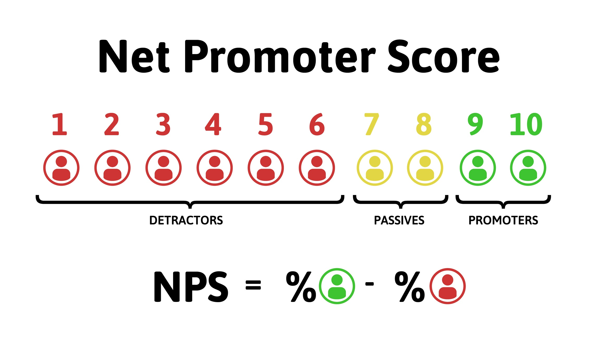

<h1 align="center">
  Net Promoter Score - NLW4 
</h1>

  <a href="#-technology">Technology</a>&nbsp;&nbsp;&nbsp;|&nbsp;&nbsp;&nbsp;
  <a href="#-project">Project</a>&nbsp;&nbsp;&nbsp;|&nbsp;&nbsp;&nbsp;
  <a href="#-license">License</a>&nbsp;&nbsp;&nbsp;

  

 

## 🚀 Technology

Esse projeto foi desenvolvido com as seguintes tecnologias:

- Node
- Typescript

## 💻 Project

Net Promoter Score (NPS) é uma API que busca através de uma pesquisa quanti-qualitativa, ter um panorama sobre a fidelidade dos seus clientes e quão satisfeitos estão com o que sua empresa oferece.

## :memo: License

Esse projeto está sob a licença MIT. Veja o arquivo [LICENSE](LICENSE.md) para mais detalhes.

---

Projeto criado durante a semana nlw4 da 🚀 [Rocketseat](https://rocketseat.com.br/) :wave: [participe da nossa comunidade!](comunidade.rocketseat.com.br) 🚀.

Feito com ♥ by Thiago Lourenço.